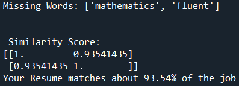
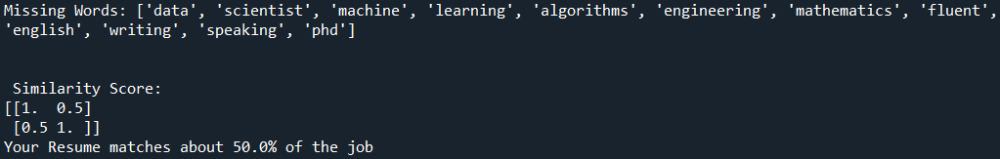
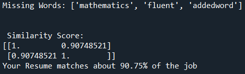

                 
### Background   

In 2014 Amazon developed a resume rating algorithm. The AI rated resumes from 1 to 5 stars to assist with the hiring process. This was done in response to longer and longer wait times for new mid-high level staff (and a higher and higher recruitment cost). The AI did this by comparing applicant resumes to successful hires in the past. The last 10 years of applicant resumes were used to do this.

Bias manifested from sources such as manager bias and training data bias. The majority of applicants and Amazon workers were male.  As the AI did not take into account gender effects it started discriminating against gendered language and certain universities known for training women. This caused outrage when the public found out about it.

The AI was scrapped in 2018 when it became clear it was very biassed against women.

### Description of Existing AI:
The AI-powered recruitment recommendation system is aimed to simplify the hiring process by using advanced techniques in natural language processing (NLP) and machine learning. By examining job descriptions and candidate resumes, the system reads crucial features to match job requirements with candidate qualifications. It then ranks candidates by considering keywords used in aspects of resume such as skills, experience, and education, using similarity scores. The system can also incorporate machine learning models trained on historical hiring data to further improve the accuracy of its recommendations. 

Input:
Applicant Resumes
Training data (resumes sent to amazon in last 10 years)
Job description - required skills/ideal applicant
 
Rules:
Trained on training data
Natural Language Processing of resumes
Skills, phrases and writing compared to hired applicants
Most similar results to hired applicants receive higher results

Output:
1 to 5 star rating of the applicants - handed to manager

Validation:
Unknown validation (AI probably validated on training data)

### Ethical Issue 
When evaluating various ethical issues surrounding Amazons’s AI recruitment  system, we decide to prioritise lack of agency as the primary ethical issue.
In the context of Amazon AI recruitment, autonomy means that while AI technology can efficiently sift through large pools of job applicants, the final decisions about hiring and communication should involve human judgement. This ensures a fairer and more autonomous hiring process.
The lack of agency in the algorithm means that the AI uses the same approach for everything. This means each part of the job description (and training data) is treated equally. Moreover, the lack of agency in AI  algorithms perpetuates a cycle of homogeneity within the workforce, as the algorithm tends to favour candidates who closely match existing employee profiles or historical hiring patterns. This leads to proxy variables discriminating against minority genders and races. Managers/ Hiring managers should be encouraged to exercise responsible oversight over AI algorithms, ensuring that decision making  processes are fair, objective, and free from discriminatory biases.     

    

### Data science perspective   
Algorithmic Bias and Fairness:
The lack of agency gives rise to concerns about algorithmic bias and fairness, this results in discriminatory outcomes for certain groups of job applicants.
When there is no agency in prioritised skills/sections, the algorithm will equally weight every thing including race and sex. This ends up perpetuating sexist and racist hiring practices.
Transparency and Accountability:
Without human involvement, transparency and accountability in the AI recruitment system may be compromised, this does not take into consideration the efforts needed to understand and address concerns about bias or errors.
Ethical Oversight and Governance:
The importance of human judgement needed for diverse ethical oversight and governance over mechanisms to ensure compliance with ethical guidelines, organisational policy and legal requirements is highlighted.
Human-Centric Design:
Designing AI recruitment systems with human agency in mind promotes a working relationship between humans and machines, it brings into consideration the strengths of both to achieve better outcomes.
In the user engagement section, we continuously optimise the recruitment system by collecting information and feedback on the match between recruiters and the recruitment system.

### Proposing Improvements

Algorithmic adjustments for fairness  ( can build a sample recruitment system  addressing bias reducing techniques … can use python libraries ) 
Ongoing monitoring and evaluation methods for bias.
Fairness correction
Validation
Recruiters can also customise filtering options to focus on candidates who meet specific criteria. To ensure ongoing relevance and effectiveness, the model is continuously refined based on feedback from recruiters. Overall, TalentMatch AI offers numerous benefits including efficiency, accuracy, scalability, and cost-effectiveness, making it an invaluable tool for modern recruitment processes.
After recruitment, we can suggest candidate you can improve some skills in xxx areas.

### New Algorithm 
Input
Position requirement (Job description)
Options for loss function in each section of resume
Keyword weight map
Heterophily vs Homophily maximisation
Applicant's resume and keywords
Output
1 to 5 stars ranking candidate 
Validation
Compare average scores of different ethnic groups and genders. Check that the baseline average score for each group is not statistically significant.
Put together a variety of fake resumes with expected rating values. Check that AI output matches the expected value.
Rules
Weighting the keywords：We introduce a keyword weighting system into the algorithm, assigning higher scores to words that reflect a gender-neutral and fair balance in the workplace. For instance, skills or achievements that do not involve gender differences should receive higher weighting.

## New Algorithm Description
This new algoritm has 2 parts: A word comparison and a LLM comparison. Both methods start by using textract to scrape text off of a job description (written in text in our prototype) and a resume (a PDF in our prototype).

### Word based matching feedback
The word comparison then removes all punctuation and common words and turns the rest of the words into tokens. The words in both inputs are compared to the words in the job description with cosine similarity to give a percent match score. The words that are only in the job description are returned as missing words to let the user know which words are missing from their resume that can be added (if they have those skills) or work on in real life to be more appealing to the job. Words that are only in the resume can be returned to refine the job description if needed, but this would be a different usecase than originally made for.

The feedback is limited as it can olny tell you if the words match. It does not take into account the meaning of sentences. For example: if the job description said "Needs to be fluent in English." and the resume said "Cannot speak english. Fluent in Java." The key words "Fluent" and "English" are present in both despite not being a match at all.

An example of a data science job description compared to a data scientist's resume can be seen in Figure 1. This same job description with a graphic designer's resume can be seen in Figure 2. The word "addedword" was added and comapred to the data scientist's resume which gave the results in Figure 3.

Figure 1: Example of a data science job description compared to a data scientist's resume.

Figure 2: Example of a data science job description compared to a graphic designer's resume.

Figure 3: Example of a data science job description compared to a data scientist's resume with a nonsence word added to the job description "addedword".

### LLM based feedback
The LLM aims to solve the lack of meaning transference by having an AI analyse the resume. It does this by taking the words from each text source and asking Open AI to compare them. The prompt it uses is: " Compare the job description and resume. give a score of similarity between 0 and 1, List the matching skills, experiences, and qualifications. Identify any gaps or areas where the resume does not meet the job description requirements." This provides both a percent similarity and feedback to note what is missing from the resume. The problem is the lack of absolute feedback, the AI model may not comment on something, or misinterpret what is passed through to it. All the general problems with AI are applicable here. However, it will not make the same mistake with the "Needs to be fluent in English." and "Cannot speak english. Fluent in Java." problem. It is very useful as recutier AI systems will probably act similarly and thus can make your resume look better from an AI perspective, which is what we are trying to solve.

By using both these systems in tandem, the user can get both concrete feedback of missing words and a more general AI based feedback which provide the missing transparency from these AI recruitment systems. The user will be able to iteratively improve their resume with these tools and have a higher chance of getting to the interview where they will have a higher chance of getting the job.

### Research articles (With Notes)
Ethics and discrimination in artificial intelligence-enabled recruitment practices
https://www.nature.com/articles/s41599-023-02079-x
Dense source with lots of information - hard to summarise VERY GOOD TO USE
Literature review on ethics and discrimination in AI recruitment
Potential benefits:
Recruitment quality
Increase efficiency
Reduced transactional work
Discriminatory hiring practices that are a problem
Gender
Race
Colour
Personality traits
These issues stem from training data set and biassed AI designers
Potential solutions to problems are:
Having unbiased dataset frameworks and improved algorithmic transparency
Using Technological tools against bias:
Data blending process
Decoupling technique
Word embedding
Differential testing
Management measures like internal corporate ethical governance and external oversight
Grounded theory for respondents’ experiences and perceptions

Amazon ditched AI recruiting tool that favored men for technical jobs
https://www.theguardian.com/technology/2018/oct/10/amazon-hiring-ai-gender-bias-recruiting-engine
Men favoured for job
Compared resume to accepted resumes
Amazon wanted a system that could just tell them who to hire
Amazon tried to edit AI to remove gendered decision, but there was worry about it using proxy measures
Gendered language was quantified instead of measures of job fit
Results ‘almost random’ - unqualified people recommended for many jobs’
Transparency a major issue
Thoughts are that AI recruitment is not bad, just the implementation

An overview of ethical issues in using AI systems in hiring with a case study of Amazon's AI based hiring tool
https://www.academia.edu/42965903/An_overview_of_ethical_issues_in_using_AI_systems_in_hiring_with_a_case_study_of_Amazons_AI_based_hiring_tool
Mid to high levels positions take longer to fill and cost more to recruit
Ai reduces time and cost
2014/2015 resume AI in Amazon gave a 5 star rating based on successful traits
Training data was primarily male leading to discrimination
Marked down resumes for having the word ‘women’
Marked down for having women's colleges
Training data need successful and failed applicants
Privacy issue
Ethical issue
How is fairness ensured?
What is fairness (all applicants are equal vs preferring those who’ve dealt with inherent disadvantages)
How is diversity ensured?
irreconcilable ideas - i.e. A new set of data the AI has not seen
Contextual integrity - what can the company do with submitted resumes (train AI? Validate?)
Liffick’s analysis 

Gender Bias in Hiring: An Analysis of the Impact of Amazon's Recruiting Algorithm
https://www.researchgate.net/publication/373896468_Gender_Bias_in_Hiring_An_Analysis_of_the_Impact_of_Amazon%27s_Recruiting_Algorithm
Investigates algorithmic gender bias using (and purposive sampling):
interpretive epistemology 
Interviews analysis
Focus groups (each group has 6-10 women)
Prior applicants who were discouraged and current employees
Natural language processing to get general messages
Bias for word associated with males applicants
40% employment rate for male applicants
20% for female
Bias in initial application, but also during interviews (lower offers, questions about marital status, etc.)
Key solutions seem to be:
Transparency increasing
Diversity goal implementation
Mentorship/training programmes
Outreach/support for women

Is AI recruiting (un)ethical? A human rights perspective on the use of AI for hiring
https://link.springer.com/article/10.1007/s43681-022-00166-4
Human right perspective on AI recruiting
Validity
Autonomy
Nondiscrimination
Privacy
Transparency
Compares positive image against ethical concerns
Defines Ai recruiting
Explains how AI recruiting is not inherently unethical
Elaborates that unethical implications come from the context AI is developed

Applicants' perception of AI in the recruitment process
https://www.sciencedirect.com/science/article/pii/S2451958823000362 
 Outlines a theoretical model to get applicant opinions on AI recruitment tools
Diverse array of applicant opinions
Diverse nationalities
Diverse Genders
Diverse ages
Shows the effect of gender, age, and education on AI perception
Models overall opinion on usefulness, but also:
Ease of use
Satisfaction
Company attractiveness with use of AI
etc.

Can AI resume screening be Biased?
https://leoforce.com/blog/tackling-ai-resume-screening-bias/ 
 Lays out key biases in human based recruitment
Lays out some key sources of AI bias effects
Biassed training data
Algorithmic bias
Lack of diversity in training data
Proxy variables
Lack of transparency and accountability
Lays out some potential solutions to keep AI less biassed
