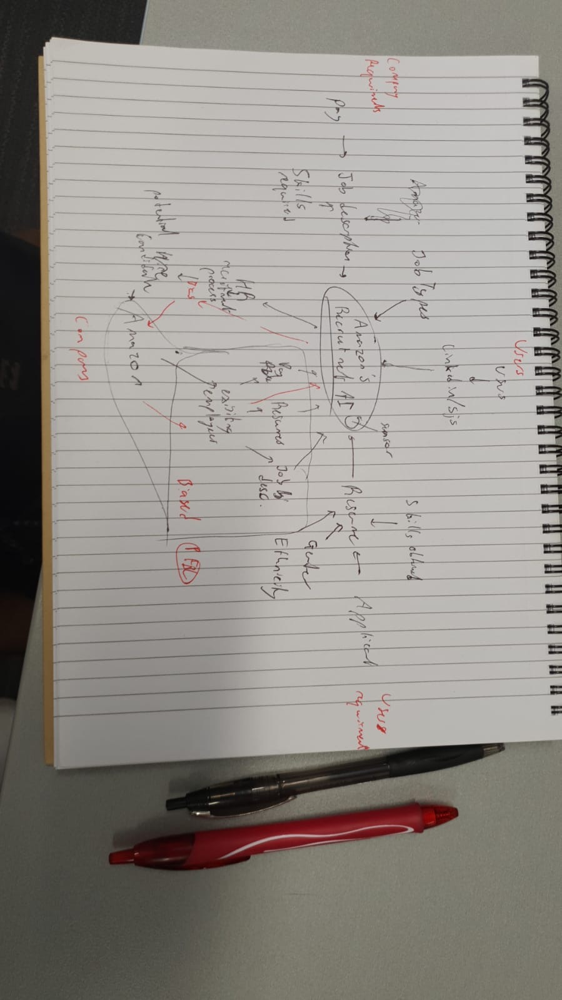

# DATA417_Group_Project
This repo is for DATA417 group project of team DSC

## Explanation of project is in outline.md

## Code is stored in prototype_code

## Amazon AI-based recruiting system
Sample code for the system can be found on the link below:- https://github.com/rohitbakoliya/sieve.ai
and solved code for our project can be similar to the NLP file in the project below:- https://github.com/marssemenova/TechTogetherFinal

### Ideas
- Feedback for the candidate and candidate can take a reference where it can improve in both career and CV.
- Further discovery on LLMs(Chatgpt, Llama) and library for python [Langchian](https://python.langchain.com/v0.1/docs/get_started/introduction/)

### Prototype

### Diagram
[Google drive invite link](https://drive.google.com/file/d/15iWeyJ5ZZqjZbVTDax3m2jQRDaAdv6BH/view?usp=drive_link)

<!-- ### Outline Doc
[Google drive invite link](https://drive.google.com/file/d/15iWeyJ5ZZqjZbVTDax3m2jQRDaAdv6BH/view?usp=drive_link)

### Xiaowen's notes

<>  -->
